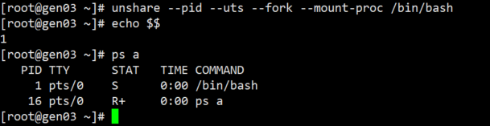

# Linux namespace介绍

## 什么是namespace？
Linux 内核中的 namespace（命名空间） 是一种轻量级资源隔离机制，它让一组进程看到一套独立的系统资源视图，与其他 namespace 互不干扰，是容器（Docker、K8s）实现隔离的核心基石。

## namespace隔离了哪些资源？

::: details 进程隔离

:::

::: details 主机与域名隔离

:::

::: details 进程间通信隔离

:::

::: details 网络资源隔离

:::

::: details 用户和组隔离

:::

::: details 挂载点隔离
:::
## 实现namespace的核心系统调用

| 系统调用  | 核心作用                                   | 关键参数说明                                                                 |
|-----------|--------------------------------------------|------------------------------------------------------------------------------|
| `clone()` | 创建新进程并为其创建/加入新 namespace      | 通过 `CLONE_NEW*` 系列标志（如 `CLONE_NEWPID`、`CLONE_NEWNET`）指定要隔离的资源；返回新进程 PID |
| `unshare()` | 在现有进程中脱离原 namespace，加入新创建的 namespace | 无需创建新进程，直接修改当前进程的资源视图；参数同 `clone()` 的 `CLONE_NEW*` 标志          |
| `setns()` | 将当前进程加入已存在的 namespace           | 需要传入目标 namespace 的文件描述符（如 `/proc/<pid>/ns/net`）；常用于进入容器的 namespace |

### unshare
unshare 是系统调用的命令行封装，适合快速验证 namespace 隔离效果，无需写代码：
```bash
# 1. 创建新的 PID + UTS namespace，启动 bash（--fork 确保新进程为 PID 1）
unshare --pid --uts --fork --mount-proc /bin/bash

# 2. 在新 namespace 内操作（仅当前环境生效）
hostname my-test-ns  # 修改主机名（UTS 隔离）
echo $$              # 输出 1（PID 隔离，新 namespace 内 PID 从 1 开始）
ps aux               # 仅能看到当前 namespace 内的进程

# 3. 验证隔离：打开新终端，执行以下命令，看不到上述修改
hostname             # 仍为宿主机名
ps aux | grep bash   # 看不到 my-test-ns 的 bash 进程
```
执行结果如下



## C语言实现资源隔离

| 标志            | 含义                 | 作用                             |
|:----------------|:---------------------|:---------------------------------|
| SIGCHLD         | 子进程退出发 SIGCHLD | 必须写，否则父进程收不到退出信号 |
| CLONE_NEWNS     | Mount                | 挂载点、文件系统视图             |
| CLONE_NEWPID    | PID                  | 进程号，容器内 PID 从 1 开始     |
| CLONE_NEWNET    | Network              | 网络栈、网卡、IP、端口、路由     |
| CLONE_NEWUTS    | UTS                  | 主机名、域名                     |
| CLONE_NEWIPC    | IPC                  | 信号量、共享内存、消息队列       |
| CLONE_NEWUSER   | User                 | UID/GID、用户权限、能力          |
| CLONE_NEWCGROUP | Cgroup               | cgroup 视图                      |
| CLONE_NEWTIME   | Time                 | 系统时钟                         |
### 版本 1：基础 clone（无任何隔离，仅创建父子进程）
这是最朴素的 clone() 用法，和 fork() 几乎等价，无任何隔离，仅验证父子进程创建逻辑。
编译并运行：<code>gcc -o clone_v1 clone_v1.c && ./clone_v1</code>


```c
#define _GNU_SOURCE
#include <sched.h>
#include <stdio.h>
#include <stdlib.h>
#include <unistd.h>
#include <sys/wait.h>
#include <signal.h>

#define STACK_SIZE (1024 * 1024)

// 子进程执行函数
int child_function(void *arg) {
    printf("子进程 - 宿主机PID：%d | 父进程PID：%d\n", getpid(), getppid());
    printf("子进程 - 主机名：");
    system("hostname"); // 输出宿主机名
    printf("子进程 - 进程列表（宿主机全部进程）：\n");
    system("ps aux | head -5"); // 能看到宿主机所有进程
    sleep(10); // 暂停10秒，方便验证
    return 0;
}

int main() {
    // 1. 分配子进程栈
    char *child_stack = malloc(STACK_SIZE);
    if (!child_stack) { perror("malloc stack"); exit(1); }
    char *stack_top = child_stack + STACK_SIZE;

    // 2. 仅用 SIGCHLD 标志调用 clone（无任何 namespace 隔离）
    pid_t child_pid = clone(child_function, stack_top, SIGCHLD, NULL);
    if (child_pid == -1) { perror("clone"); free(child_stack); exit(1); }

    // 3. 父进程逻辑
    printf("父进程 - 自身PID：%d | 子进程PID：%d\n", getpid(), child_pid);
    waitpid(child_pid, NULL, 0); // 等待子进程退出
    free(child_stack);
    return 0;
}
```


### 版本 2：添加 PID/UTS 隔离（核心 namespace 体验）
在版本 1 基础上添加 CLONE_NEWPID | CLONE_NEWUTS，体现进程 ID 隔离和主机名隔离，这是容器最直观的隔离效果。
```c
#define _GNU_SOURCE
#include <sched.h>
#include <stdio.h>
#include <stdlib.h>
#include <unistd.h>
#include <sys/mount.h>
#include <sys/wait.h>
#include <signal.h>

#define STACK_SIZE (1024 * 1024)

int child_function(void *arg) {
    // ========== 关键：PID隔离必须重新挂载/proc ==========
    umount("/proc"); // 卸载原有/proc
    if (mount("proc", "/proc", "proc", 0, NULL) == -1) {
        perror("mount /proc"); exit(1);
    }

    // ========== UTS隔离：修改主机名（仅子进程生效） ==========
    if (sethostname("isolated-ns", 11) == -1) {
        perror("sethostname"); exit(1);
    }

    // 验证隔离效果
    printf("子进程 - 隔离空间内PID：%d（不再是宿主机全局PID）\n", getpid()); // 输出 1
    printf("子进程 - 隔离空间内主机名：");
    system("hostname"); // 输出 isolated-ns（宿主机名不变）
    printf("子进程 - 仅能看到自身进程：\n");
    system("ps aux"); // 仅显示 bash/ps 等少数进程，无宿主机其他进程

    // 启动shell，方便手动验证
    execlp("/bin/bash", "bash", NULL);
    perror("execlp bash");
    return 0;
}

int main() {
    char *child_stack = malloc(STACK_SIZE);
    if (!child_stack) { perror("malloc stack"); exit(1); }
    char *stack_top = child_stack + STACK_SIZE;

    // ========== 核心变化：添加 CLONE_NEWPID | CLONE_NEWUTS ==========
    pid_t child_pid = clone(
        child_function,
        stack_top,
        CLONE_NEWPID | CLONE_NEWUTS | CLONE_NEWIPC | SIGCHLD, // 新增隔离标志
        NULL
    );

    if (child_pid == -1) { perror("clone"); free(child_stack); exit(1); }

    printf("父进程 - 宿主机PID：%d\n", getpid());
    printf("父进程 - 子进程在宿主机的PID：%d（隔离空间内是1）\n", child_pid);
    waitpid(child_pid, NULL, 0);
    free(child_stack);
    return 0;
}
```

### 版本 3：添加网络 / 挂载隔离（完整资源隔离）
在版本 2 基础上添加 CLONE_NEWNET | CLONE_NEWNS，实现网络隔离和文件系统挂载隔离，接近容器的 “独立环境”。
```c
#define _GNU_SOURCE
#include <sched.h>
#include <stdio.h>
#include <stdlib.h>
#include <unistd.h>
#include <sys/mount.h>
#include <sys/wait.h>
#include <signal.h>
#include <sys/socket.h>
#include <net/if.h>

#define STACK_SIZE (1024 * 1024)

int child_function(void *arg) {
    // 1. 重新挂载/proc（PID隔离必需）
    umount("/proc");
    if (mount("proc", "/proc", "proc", 0, NULL) == -1) { perror("mount /proc"); exit(1); }

    // 2. UTS隔离：修改主机名
    sethostname("full-isolated-ns", 14);

    // 3. 挂载隔离：创建临时目录作为独立挂载点（可选）
    mkdir("/tmp/ns-mount", 0755);
    if (mount("tmpfs", "/tmp/ns-mount", "tmpfs", 0, NULL) == -1) {
        perror("mount tmpfs"); // 失败不影响核心逻辑
    }

    // 4. 验证网络隔离
    printf("子进程 - 网络隔离：仅能看到回环网卡\n");
    system("ip addr"); // 仅显示 lo 网卡，宿主机的 eth0/ens33 消失
    system("ip link set lo up"); // 启动回环网卡

    // 启动shell验证
    execlp("/bin/bash", "bash", NULL);
    perror("execlp bash");
    return 0;
}

int main() {
    char *child_stack = malloc(STACK_SIZE);
    if (!child_stack) { perror("malloc stack"); exit(1); }
    char *stack_top = child_stack + STACK_SIZE;

    // ========== 核心变化：添加 CLONE_NEWNET | CLONE_NEWNS ==========
    pid_t child_pid = clone(
        child_function,
        stack_top,
        CLONE_NEWPID | CLONE_NEWUTS | CLONE_NEWIPC | CLONE_NEWNET | CLONE_NEWNS | SIGCHLD,
        NULL
    );

    if (child_pid == -1) { perror("clone"); free(child_stack); exit(1); }

    printf("父进程 - 宿主机PID：%d\n", getpid());
    printf("父进程 - 子进程宿主机PID：%d\n", child_pid);
    waitpid(child_pid, NULL, 0);
    free(child_stack);
    return 0;
}
```