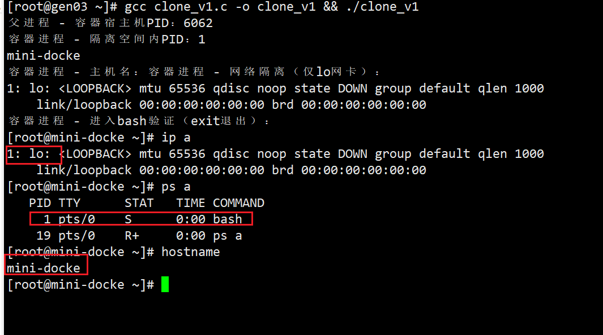

# 利用C语言模拟docker
整个实验利用c语言，和clone，mount等系统调用模拟docker中资源约束，命名空间，挂载卷等功能。目标是通过最简单的实验模拟出容器的核心特点，以达到深刻的理解。
## 实验简要流程
环境准备：CentOS 7 系统下安装编译 / 测试依赖，关闭 SELinux / 防火墙，配置内核参数；
基础资源准备：创建极简 rootfs（模拟 Docker 镜像）、宿主机数据卷目录；
代码递进实现：
版本 1：基础 clone 父子进程（无隔离 / 约束）；
版本 2：添加 namespace 隔离（PID/UTS/ 网络 / Mount）；
版本 3：添加 cgroup 资源约束（CPU / 内存）；
版本 4：挂载自定义 rootfs（模拟镜像根文件系统）；
版本 5：添加 bind mount 模拟 -v 数据卷挂载（最终版，极简 Docker）；
编译运行验证：每个版本编译后运行，验证对应隔离 / 约束 / 挂载效果。

## 一、实验环境准备
### 系统基础配置
```bash
# 1. 关闭 SELinux（避免权限拦截）
setenforce 0
sed -i 's/^SELINUX=enforcing/SELINUX=disabled/' /etc/selinux/config

# 2. 关闭防火墙（避免网络 namespace 干扰）
systemctl stop firewalld && systemctl disable firewalld

# 3. 加载 overlay 模块（可选，用于 COW 验证）
modprobe overlay
```

### 安装依赖工具
```bash
# 编译依赖
yum install -y gcc glibc-devel make

# 测试工具
yum install -y epel-release && yum install -y stress iproute

# 基础工具
yum install -y bash coreutils
```

### 准备实验基础资源
```bash
# 1. 创建 rootfs 目录（模拟 Docker 镜像）
mkdir -p /tmp/my-rootfs/{bin,dev,proc,sys,tmp,data,lib64}

# 2. 复制 bash 及依赖（CentOS 7 64 位适配）
cp /bin/bash /tmp/my-rootfs/bin/
# 复制核心依赖库（根据 ldd 输出补充）
ldd /bin/bash | grep -o '/lib64/[^ ]*\.so[^ ]*' | xargs -I {} cp -v {} /tmp/my-rootfs/lib64/

# 3. 创建必要设备文件（CentOS 7 完整适配）
mknod /tmp/my-rootfs/dev/null c 1 3
mknod /tmp/my-rootfs/dev/zero c 1 5
mknod /tmp/my-rootfs/dev/tty c 5 0
mknod /tmp/my-rootfs/dev/stdin c 1 0
mknod /tmp/my-rootfs/dev/stdout c 1 1
mknod /tmp/my-rootfs/dev/stderr c 1 2
chmod 666 /tmp/my-rootfs/dev/{null,zero,tty,stdin,stdout,stderr}

# 4. 创建宿主机数据卷目录（模拟 -v 挂载源）
mkdir -p /tmp/host-data && echo "CentOS 7 宿主机测试数据" > /tmp/host-data/test.txt
```

## 二、代码实现
### 版本 1：基础 clone 父子进程
::: details 编译并运行
gcc clone_v1.c -o clone_v1 && ./clone_v1
:::
```c
#define _GNU_SOURCE
#include <sched.h>
#include <stdio.h>
#include <stdlib.h>
#include <unistd.h>
#include <sys/wait.h>
#include <signal.h>

#define STACK_SIZE (1024 * 1024)

int child_func(void *arg) {
    printf("子进程 - 自身PID：%d | 父进程PID：%d\n", getpid(), getppid());
    printf("子进程 - 无任何隔离，可访问宿主机所有资源\n");
    sleep(10);
    return 0;
}

int main() {
    char *child_stack = malloc(STACK_SIZE);
    if (!child_stack) { perror("malloc stack"); exit(1); }
    char *stack_top = child_stack + STACK_SIZE;

    pid_t child_pid = clone(child_func, stack_top, SIGCHLD, NULL);
    if (child_pid == -1) { perror("clone"); free(child_stack); exit(1); }

    printf("父进程 - 自身PID：%d | 子进程PID：%d\n", getpid(), child_pid);
    waitpid(child_pid, NULL, 0);
    free(child_stack);
    return 0;
}
```

### 版本 2：添加 namespace 隔离
::: details 编译并运行
gcc clone_v2.c -o clone_v2 && sudo ./clone_v2
:::

```c
#define _GNU_SOURCE
#include <sched.h>
#include <stdio.h>
#include <stdlib.h>
#include <unistd.h>
#include <sys/mount.h>
#include <sys/wait.h>
#include <signal.h>
#include <errno.h>

#define STACK_SIZE (1024 * 1024)

int child_func(void *arg) {
    // PID隔离：重新挂载/proc
    umount("/proc");
    if (mount("proc", "/proc", "proc", 0, NULL) == -1) {
        perror("mount /proc"); exit(1);
    }

    // UTS隔离：修改主机名
    if (sethostname("mini-docker", 10) == -1) {
        perror("sethostname"); exit(1);
    }

    // 验证隔离效果
    printf("容器进程 - 隔离空间内PID：%d\n", getpid()); // 输出1
    printf("容器进程 - 主机名："); system("hostname"); // 输出mini-docker
    printf("容器进程 - 网络隔离（仅lo网卡）：\n"); system("ip addr");
    printf("容器进程 - 进入bash验证（exit退出）：\n");
    execlp("/bin/bash", "bash", NULL);
    perror("execlp bash");
    return 1;
}

int main() {
    char *child_stack = malloc(STACK_SIZE);
    if (!child_stack) { perror("malloc stack"); exit(1); }
    char *stack_top = child_stack + STACK_SIZE;

    pid_t child_pid = clone(
        child_func,
        stack_top,
        CLONE_NEWPID | CLONE_NEWUTS | CLONE_NEWNET | CLONE_NEWNS | SIGCHLD,
        NULL
    );
    if (child_pid == -1) { perror("clone"); free(child_stack); exit(1); }

    printf("父进程 - 容器宿主机PID：%d\n", child_pid);
    waitpid(child_pid, NULL, 0);
    free(child_stack);
    return 0;
}
```
执行结果如下：

::: details 验证效果
PID 隔离：容器内 echo $$ 输出 1，ps aux 仅见容器内进程；
UTS 隔离：主机名改为 mini-docker，宿主机无变化；
网络隔离：仅能看到 lo 网卡，无物理网卡；
Mount 隔离：容器内挂载操作不影响宿主机。
:::


### 版本 3：添加 cgroup 资源约束
