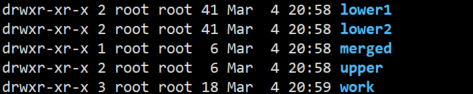
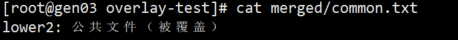
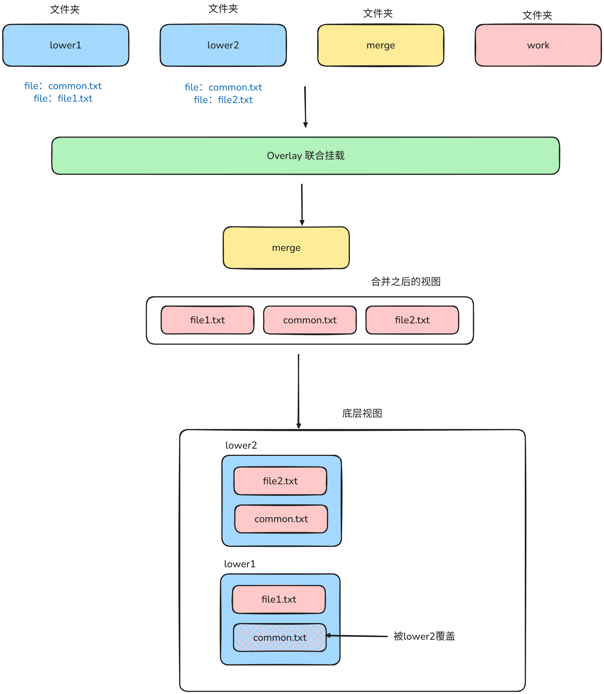
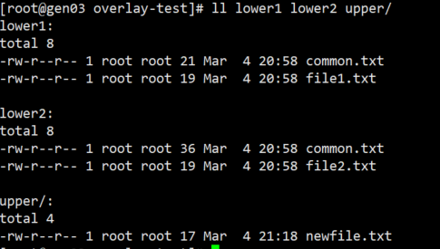
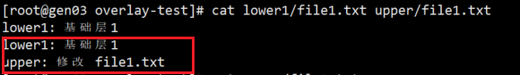
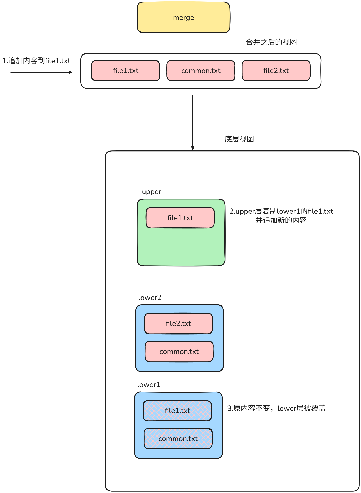
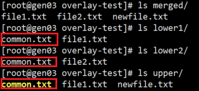
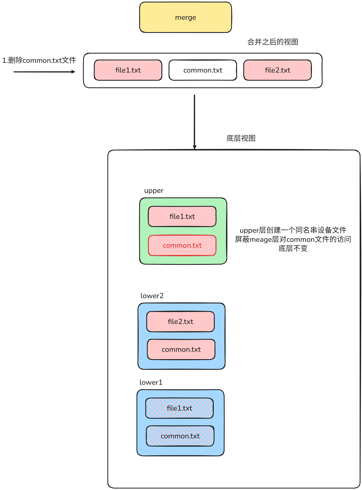

# overlay 联合文件系统
## 一、Overlay 文件系统核心概念
OverlayFS 是一种堆叠式文件系统，核心由 4 个关键目录组成：
| 目录     | 作用                                 | 特性                                                                   |
|:---------|:-------------------------------------|:-----------------------------------------------------------------------|
| lowerdir | 底层只读目录（可多个，用 : 分隔）    | 只能读，无法修改；多个 lowerdir 按顺序叠加，前面的会覆盖后面的同名文件 |
| upperdir | 上层可写目录                         | 所有写操作（创建 / 修改 / 删除）都只发生在这一层，不影响 lowerdir      |
| workdir  | 临时工作目录（必须为空，由内核使用） | 存储临时文件，保证 overlay 事务一致性，用户不可操作                    |
| merged   | 挂载点（合并后的统一视图）           | 用户实际访问的目录，看起来是 lower + upper 的合并结果                  |

## 二、Overlay特性探测
### 实验目标1：探测多级lover层堆叠顺序
#### 实验步骤
首先创建一个Overlay测试环境，创建目录结构
```bash
# 创建根目录
mkdir -p /tmp/overlay-test
cd /tmp/overlay-test

# 创建分层目录
mkdir lower1 lower2 upper work merged

# 给 lower 层添加测试文件（模拟只读底层）
echo "lower1: 基础层1" > lower1/file1.txt
echo "lower1: 公共文件" > lower1/common.txt
echo "lower2: 基础层2" > lower2/file2.txt
echo "lower2: 公共文件（覆盖lower1）" > lower2/common.txt  # 和 lower1 同名，测试覆盖
```
最终的目录结构如下：


使用mount命令，将lower1，lower2挂载到merged目录下
```bash
# 核心挂载命令（需 root 权限，加 sudo）
sudo mount -t overlay overlay -o lowerdir=lower2:lower1,upperdir=upper,workdir=work ./merged

# 观测堆叠顺序
cat merged/common.txt
```
#### 观测结果图

#### 逻辑原理图


### 实验目标2：探测upper层创建，修改，删除特征
#### 创建
在merge文件夹中创建新文件
```bash
# 在 merged 中创建新文件
echo "upper: 新文件" > merged/newfile.txt

# 检查各层：新文件只出现在 upper 层，lower 层无变化
ls lower1/ lower2/  # 无 newfile.txt
ls upper/            # 有 newfile.txt
```

#### 观测结果图

#### 修改
往file1.txt追加内容
```bash
# 修改 merged 中的 file1.txt（来自 lower1）
echo "upper: 修改 file1.txt" >> merged/file1.txt

# 检查各层：
cat lower1/file1.txt  # 依然是原始内容（lower 只读，无变化）
cat upper/file1.txt   # 出现修改后的完整内容（Copy-on-Write 机制）
```
#### 观测结果图
lower层不变，upper层出现新的文件file1，并覆盖了lower层

#### 原理图


#### 删除
删除merage中的common.txt文件
```bash
# 删除 merged 中的 common.txt（来自 lower2）
rm merged/common.txt

# 检查各层：
ls lower2/            # common.txt 依然存在（lower 只读）
ls upper/             # 出现一个特殊的 whiteout 文件（.wh.common.txt）
```
#### 观测结果图
lower层不变，upper层出现一个同名字的串设备文件，屏蔽meage层的访问


#### 原理图
