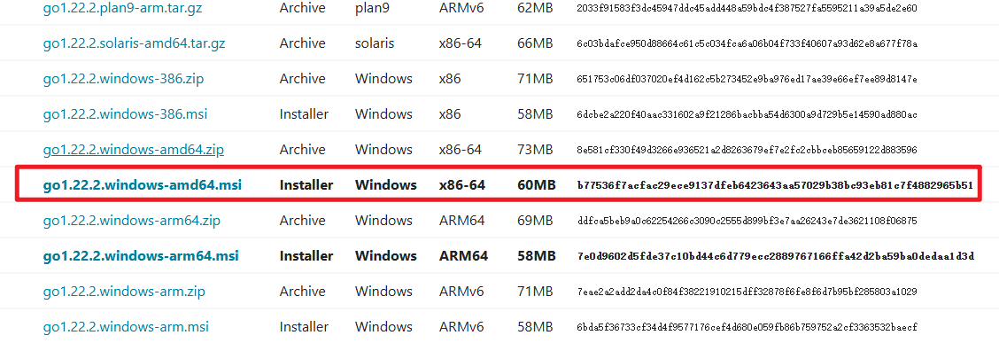
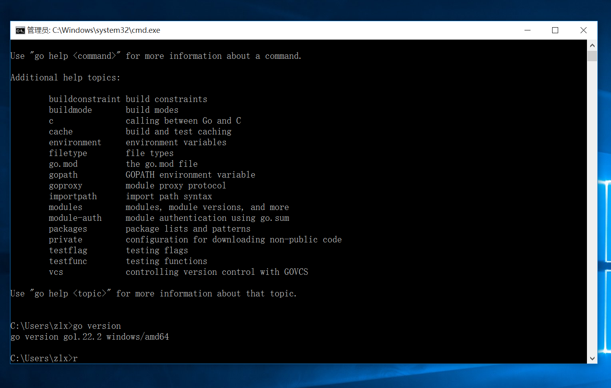
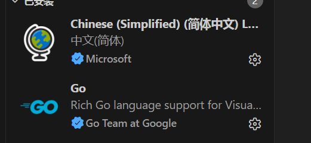
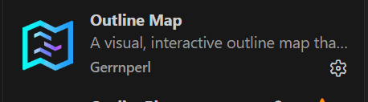
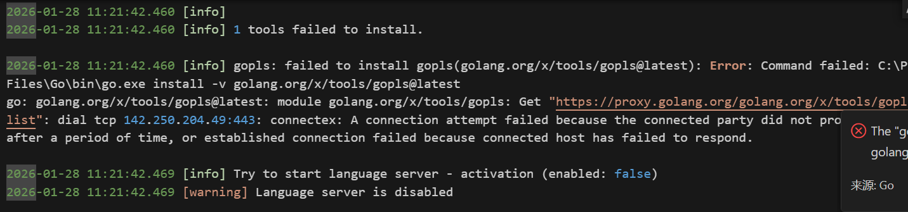
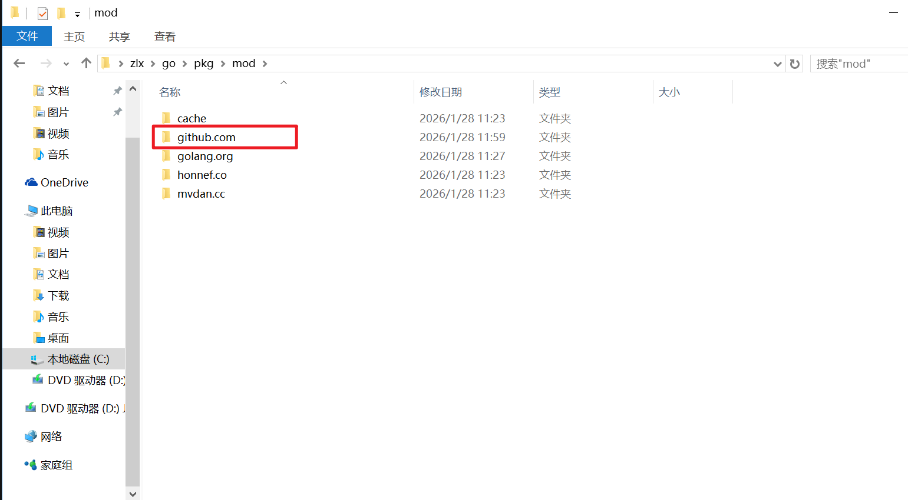
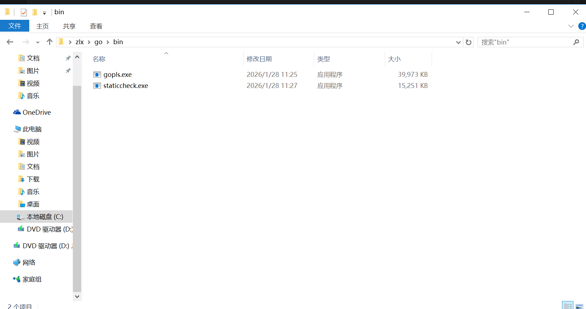
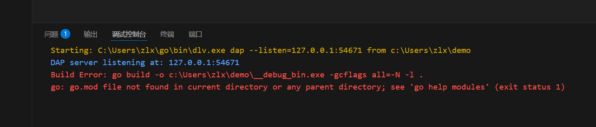

# 环境搭建
**01-版本选择**

一般不追新，约定好指定版本之后，除非之后检测到bug，否则部署上线不改。

本次实验为了1.22.x的新特性，选择1.22.x

**02-官网下载**

下载路径：[All releases - The Go Programming Language](https://golang.google.cn/dl/)






**环境变量**

GOROOT：go的安装目录C:\Program Files\Go\bin

- bin：go.exe 编译器
- src：标准库源代码

GOPATH：新版本中，只是存放第三方依赖包下载源码缓存路径

- %USERPROFILE%\go

BIN：第三方库编译后的可执行文件的目录

- %USERPROFILE%\go\bin

GOPROXY

- 国外的包访问不到，可以使用这个变量指定代理
- 推荐7牛云：

```bash
# 临时
go env -w GO111MODULE=on
go env -w GOPROXY=https://goproxy.cn,direct
# windows 永久设置 PowerShell 
C:\> $env:GO111MODULE = "on"
C:\> $env:GOPROXY = "https://goproxy.cn"
# linux 永久设置
$ echo "export GO111MODULE=on" >> ~/.profile
$ echo "export GOPROXY=https://goproxy.cn" >> ~/.profile
$ source ~/.profile
```


**03- go env命令**

```bash
C:\Program Files\Go\bin>go env
set GO111MODULE= # 1.16之后哦不需要配置了，默认都是on
set GOARCH=amd64
set GOBIN=
set GOCACHE=C:\Users\zlx\AppData\Local\go-build
set GOENV=C:\Users\zlx\AppData\Roaming\go\env
set GOEXE=.exe
set GOEXPERIMENT=
set GOFLAGS=
set GOHOSTARCH=amd64
set GOHOSTOS=windows
set GOINSECURE=
set GOMODCACHE=C:\Users\zlx\go\pkg\mod # 第三方模块下载缓存路径
set GONOPROXY=
set GONOSUMDB=
set GOOS=windows
set GOPATH=C:\Users\zlx\go
set GOPRIVATE=
set GOPROXY=https://proxy.golang.org,direct # 代理，需要修改
set GOROOT=C:\Program Files\Go
set GOSUMDB=sum.golang.org
set GOTMPDIR=
set GOTOOLCHAIN=auto
set GOTOOLDIR=C:\Program Files\Go\pkg\tool\windows_amd64
set GOVCS=
set GOVERSION=go1.22.2
set GCCGO=gccgo
set GOAMD64=v1 
set AR=ar
set CC=gcc
set CXX=g++
set CGO_ENABLED=0
set GOMOD=NUL
set GOWORK=
set CGO_CFLAGS=-O2 -g
set CGO_CPPFLAGS=
set CGO_CXXFLAGS=-O2 -g
set CGO_FFLAGS=-O2 -g
set CGO_LDFLAGS=-O2 -g
set PKG_CONFIG=pkg-config
set GOGCCFLAGS=-m64 -fno-caret-diagnostics -Qunused-arguments -Wl,--no-gc-sections -fmessage-length=0 -ffile-prefix-map=C:\Users\zlx\AppData\Local\Temp\go-build3058398697=/tmp/go-build -gno-record-gcc-switches
```

**vscode配置**

安装插件：

- go插件已经集成：gopls必须
- go插件已经集成：staticheck语法检查






安装依赖失败：



手动安装

```bash
 go install golang.org/x/tools/gopls@latest
 go install honnef.co/go/tools/cmd/staticcheck@latest
```

配置使用gopls语法高亮

```bash
打开 VS Code 设置（Ctrl+,）；
搜索「gopls」，找到「Go > Gopls: Advanced Settings」；
添加配置：
"gopls": {
         "formatting.gofumpt": true,
         "ui.semanticTokens": true
    }
```


下载的“gopls” 在目录C:\Users\zlx\go\pkg\mod\github.com下，gomod是基于域名管理的，下载当前包的时候也会下载他的依赖，他的依赖不一定是放在github下的。



编译好的放在bin下




使用F5编译，需要安装第三方工具

```
go install github.com/go-delve/delve/cmd/dlv@v1.22.0
```

如果用dlv调试的话，必须是gomod管理的目录，否则会报错 

