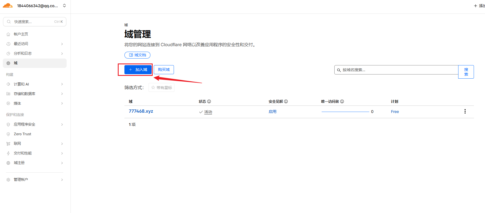
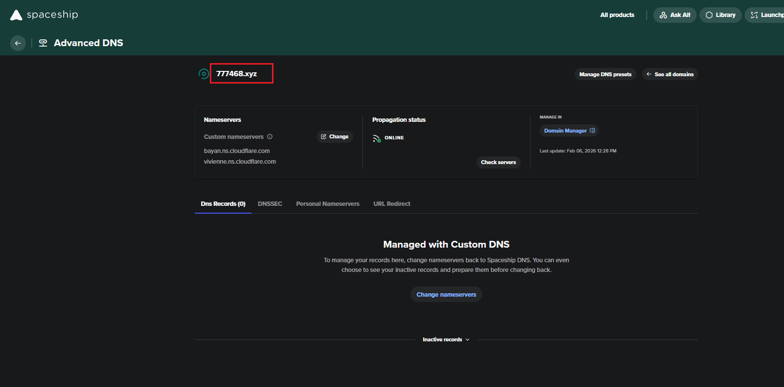
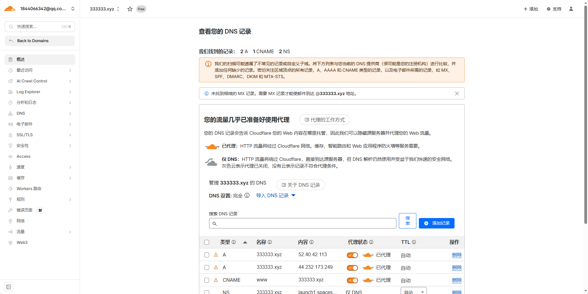
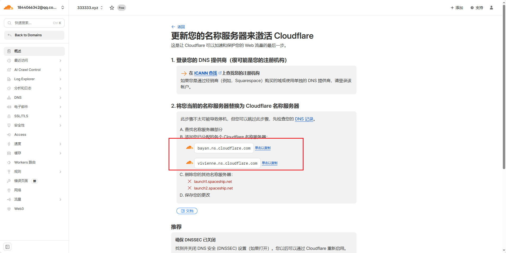
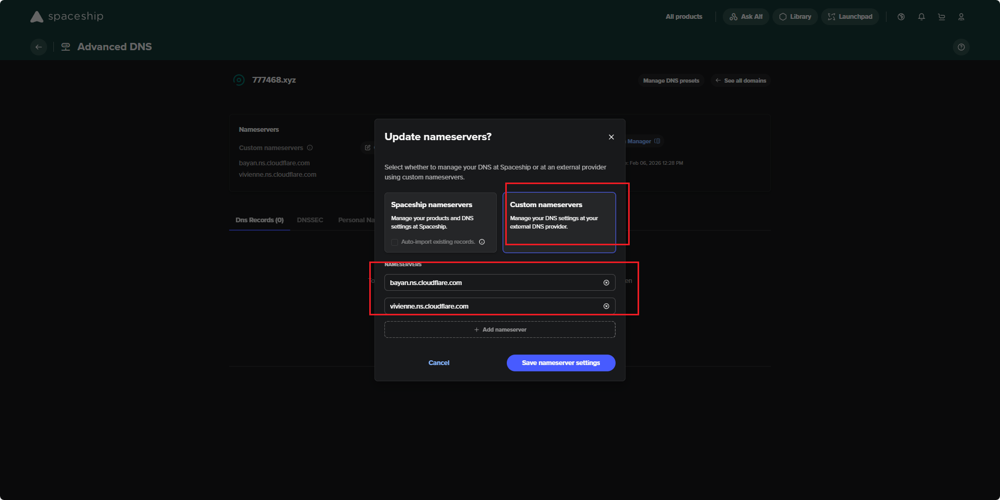
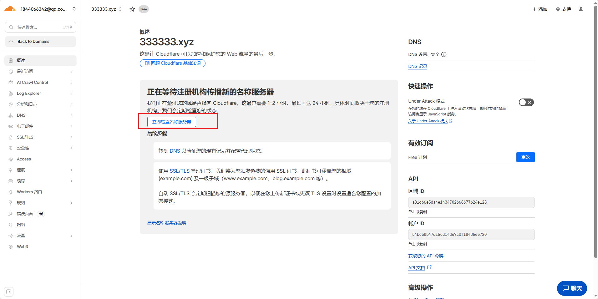
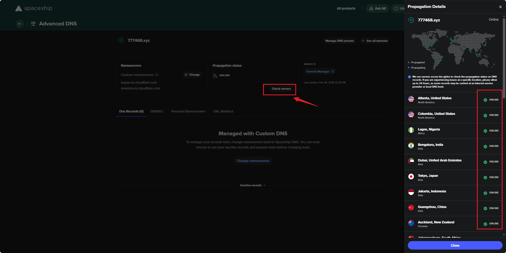
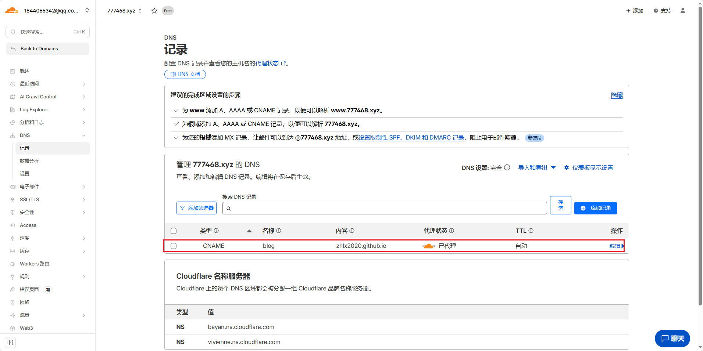
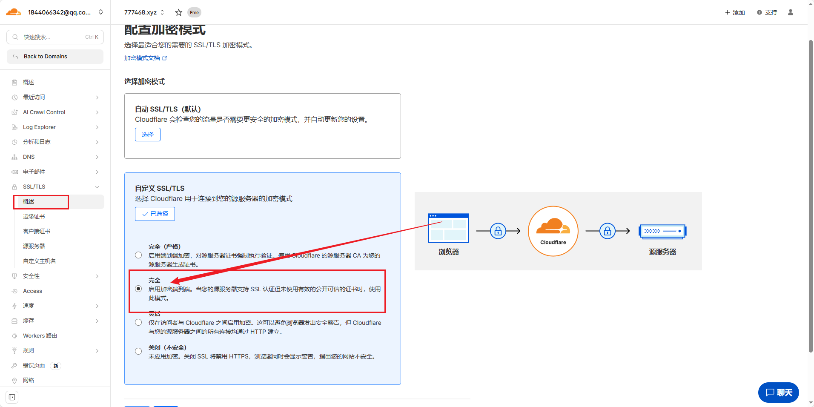
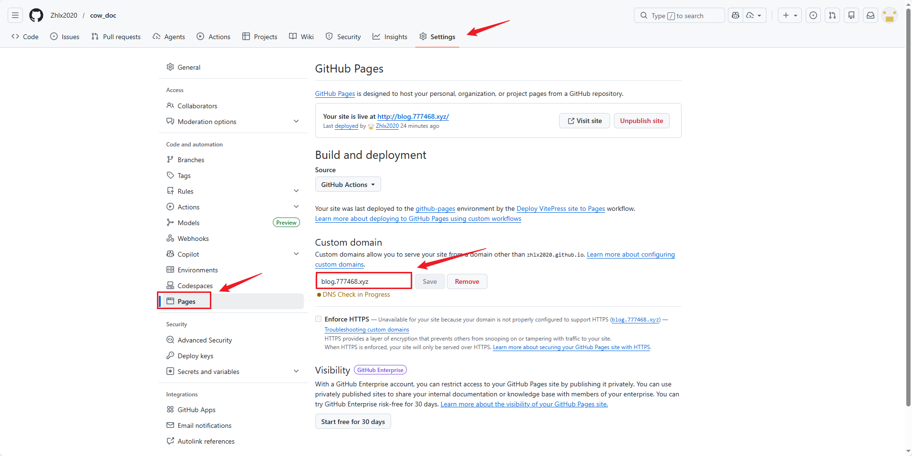

# VitePress部署流程

## 购买域名
https://www.spaceship.com/zh/application/advanced-dns-application/manage/777468.xyz/
## 托管域名

注册Cloudflare之后，进入域管理，点击加入域。

回到space网站中，找到自己的主域名（这里假设我的域名为33333.xyz）

将主域名粘贴到Cloudflare域输入框

选择免费计划

这里是告诉你你的这个域名已经做了哪些解析，不用管

这里Cloudflare给你分配了两个域名服务器，你需要将这两个域名服务器配置到space中

进入space，点击change按钮

选择自定义name server，然后填入 Cloudflare 的域名服务器

完成之后回到Cloudflare点击立即检测，这里大概要1小时左右同步

可以回到space中，查看同步的进度，所有的服务器都online就可以了

检测通过后，配置cname域名解析，名称配置blog（自动拼接为blog.33333.xyz），内容配置为gitpage提供的zhlx2020.github.io

最后去ssl界面，将端对端连接方式改为full

然后去github的gitpage中配置自定义域名为blog.33333.xyz

最后访问网站，看是否成功
